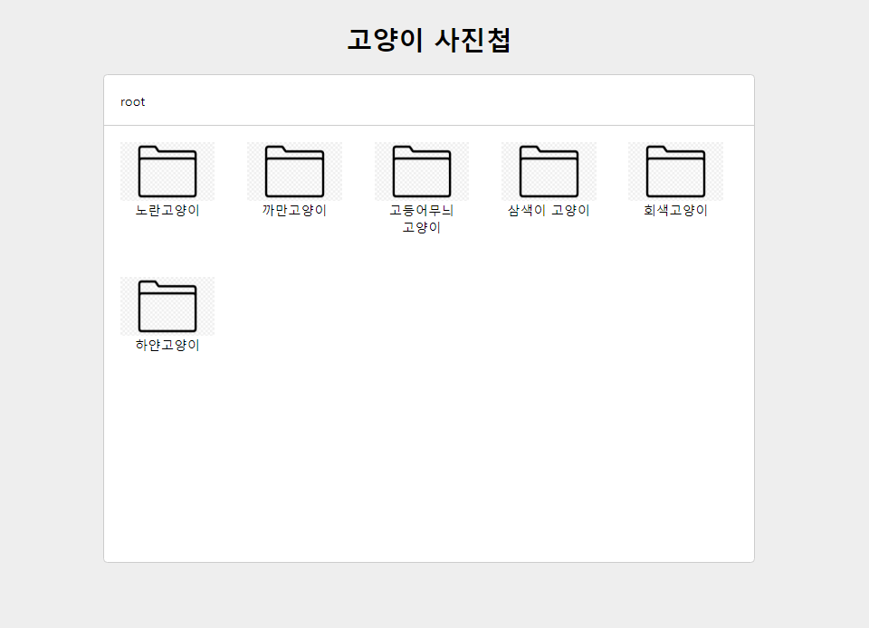
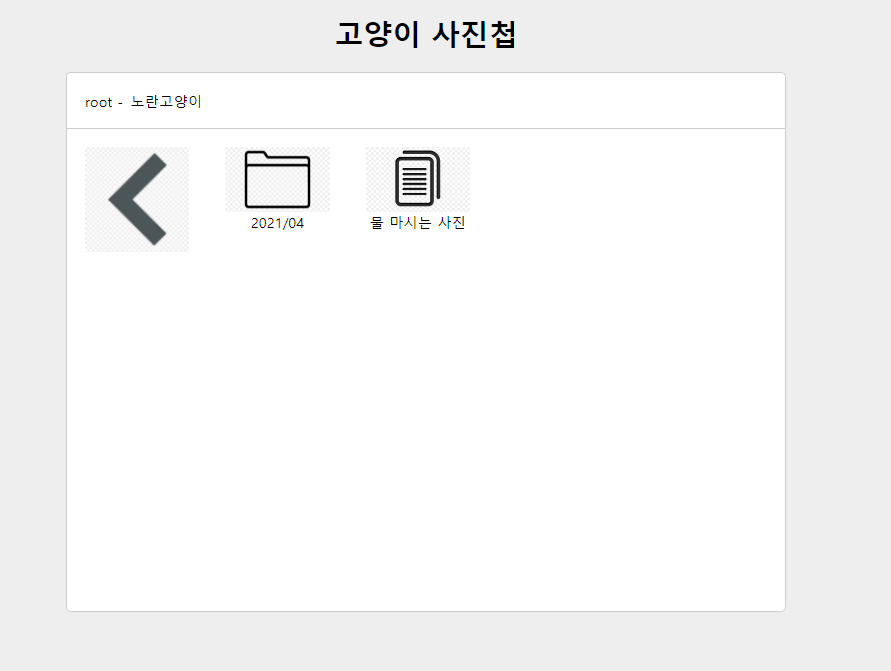
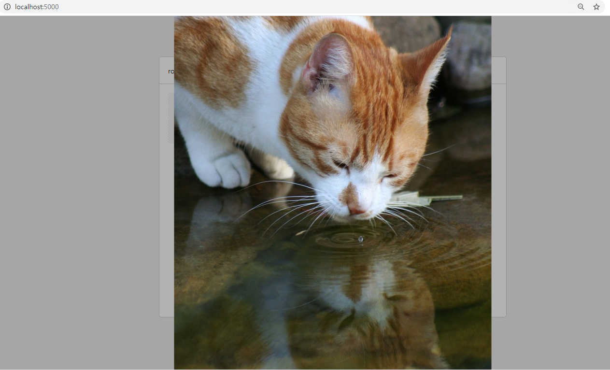

# A simple cat photo album site that simulates a file directory systems

## Tech Skills

- Serve - npm
- HTML
- CSS
- API - provided

## Screenshots

### Root Directory

### Sub Directory

### Files

## How to run

### npm start

## Next project

### Implement API and Deploy
